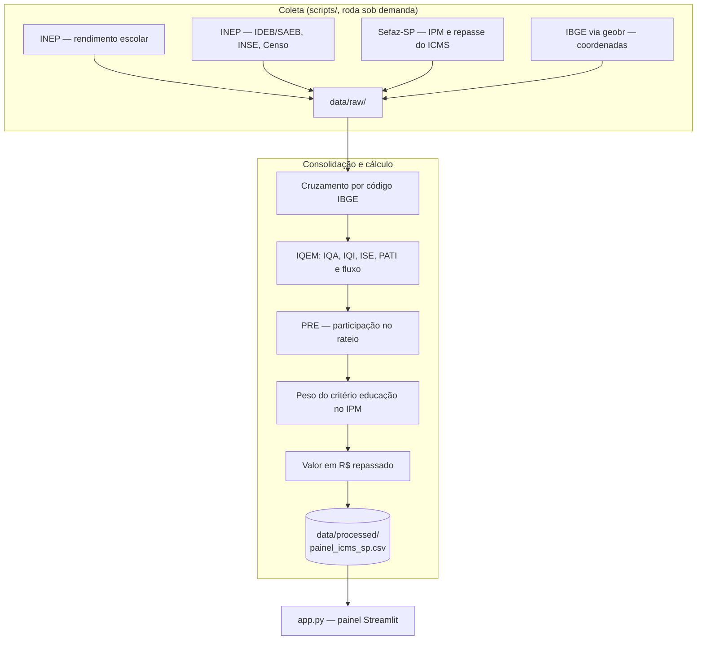

# ICMS Educacional SP

Painel que simula quanto cada município paulista receberia de ICMS sob o
critério de educação da Lei 17.575/2022, e compara esse valor com o que ele
recebe hoje pela regra antiga.

**Painel no ar:**
[icms-educacional-sp.streamlit.app](https://icms-educacional-sp-hzubqvwdrtfbtmyfhwkchx.streamlit.app)

> Hospedado no plano gratuito do Streamlit Cloud, que hiberna o app após um
> período sem acesso. Se aparecer a tela de app adormecido, basta clicar no
> botão e aguardar alguns segundos.

## Problema

São Paulo mudou a regra de distribuição da cota-parte do ICMS destinada à
educação. A Lei 17.575/2022, alterada pela Lei 18.381/2025, substitui o
critério anterior — metade qualidade, metade porte da rede — por um índice
de qualidade da educação municipal (IQEM) com peso integral.

A mudança redistribui dinheiro entre 645 municípios, mas o efeito prático não
está disponível em lugar nenhum: o painel oficial de monitoramento previsto na
lei só entra em operação no ciclo de avaliação de **2027**, com repasse em
**2028**. Até lá, nenhum município sabe quanto ganha ou perde com a nova regra,
nem quanto deixa de receber por não atingir as metas.

Este projeto responde a essas duas perguntas com dados públicos, deixando
explícito onde usa fonte oficial e onde precisou aproximar.

## Como funciona



### As etapas

**1. Coleta** — cada fonte tem um script próprio em [scripts/](scripts/), que
baixa direto do órgão oficial e registra no docstring a URL e a data em que
ela foi confirmada:

| Script | O que coleta | Origem |
|---|---|---|
| `coleta_rendimento_inep.py` | Taxas de reprovação e abandono | INEP — Taxas de Rendimento Escolar |
| `coleta_ideb_saeb_inep.py` | IDEB / SAEB dos anos iniciais | INEP |
| `coleta_ise_pati_inep.py` | Nível socioeconômico e tempo integral | INEP — INSE e Censo Escolar |
| `coleta_ipm_sefaz.py` | IPM oficial, com a Cota Parte Educação já calculada | Sefaz-SP |
| `coleta_repasse_icms_sefaz.py` | ICMS repassado em R$, mês a mês | Sefaz-SP |
| `coords_sp.py` | Coordenadas dos municípios | IBGE via `geobr` |

**2. Consolidação** ([consolidar_calcular_sp.py](consolidar_calcular_sp.py)) —
cruza as fontes por código IBGE e aplica a fórmula.

**3. Cálculo** ([calculadora_icms_vaar_sp.py](calculadora_icms_vaar_sp.py)) —
implementa o IQEM a partir de IQA, IQI, ISE e PATI, e a elegibilidade ao VAAR
do Fundeb. Os pesos e as regras estão referenciados no docstring do módulo,
com a resolução ou lei de origem de cada um.

**4. Três cenários por município** — o painel não mostra um número, mostra a
distância entre três:

- **Participação simulada** — o que o município receberia pela fórmula nova,
  com o desempenho que ele tem hoje
- **Participação máxima hipotética** — o que receberia se atingisse o
  desempenho máximo controlável por política pública
- **Participação oficial de hoje** — o que a Sefaz-SP efetivamente distribui
  pela fórmula antiga

A diferença entre o primeiro e o terceiro é o **impacto da mudança de regra**.
A diferença entre o primeiro e o segundo é **quanto o município deixa na
mesa** por não bater as metas.

**5. Cadeia até o real** — a participação percentual é convertida em dinheiro
aplicando o peso do critério educação no IPM sobre o ICMS efetivamente
repassado no período.

**6. Painel** ([app.py](app.py)) — quatro seções:

- **Visão geral** — distribuição do IQEM e dos seus componentes entre os
  municípios processados, cada métrica comparada contra a média
- **Por município** — a cadeia completa de um município, do IQEM ao valor em
  R$, com a posição dele no ranking
- **Tabela completa** — todos os municípios simulados, exportável
- **Metodologia** — o que é dado oficial e o que é aproximação, lado a lado

Base atual: **618 municípios**, períodos **2025 e 2026**, 40 colunas em
`painel_icms_sp.csv`. O recorte de 618 em vez dos 645 do estado está
justificado em [LIMITACOES_METODOLOGICAS.md](LIMITACOES_METODOLOGICAS.md).

## Dado oficial e dado aproximado

Essa separação é o centro do projeto e está documentada campo a campo em
[LIMITACOES_METODOLOGICAS.md](LIMITACOES_METODOLOGICAS.md).

**Oficial, sem transformação além da consolidação:** taxas de reprovação e
abandono (INEP, rede municipal), PATI (INEP, Censo Escolar), coordenadas
(IBGE) e a participação vigente hoje (Sefaz-SP).

**Aproximado, e por quê:** a lei exige resultados do SARESP da rede
**municipal**, separados em 2º ano (IQA) e 5º ano (IQI). Esse dado não existe
em formato público: a Seduc-SP só publica em dados abertos os resultados da
rede **estadual**. O projeto usa IDEB/SAEB dos anos iniciais como proxy, e o
ISE também entra como aproximação documentada.

Nenhum número do painel é apresentado como oficial quando não é.

## Correção de um bug de cruzamento

[FIX_transform.py](FIX_transform.py) documenta e corrige uma falha silenciosa
no cruzamento original: a chave de junção era criada sem remover acentuação,
enquanto as bases nacionais trazem os nomes sem acento e a base do IBGE traz a
grafia oficial acentuada. Como o merge usava `how='inner'`, os municípios cujo
nome não batia byte a byte eram descartados sem aviso.

Medido em 04/09/2026: **363 de 645 municípios** cruzavam antes da correção
(56%), contra **632 de 645** depois (98%). Os 13 restantes são casos de
apóstrofo, hífen ou mudança de nome, que exigem dicionário de exceções.

## Stack

| Camada | Escolha |
|---|---|
| Painel | Streamlit |
| Dados | pandas |
| Gráficos | Plotly |
| Coleta | `requests`, `pdfplumber` (PDFs da Sefaz e do FNDE) |
| Geografia | `geobr` (IBGE), `folium` (mapa de calor) |

O [requirements.txt](requirements.txt) lista apenas `streamlit`, `pandas` e
`plotly` — o que o painel publicado precisa. As dependências da coleta
(`geobr`, `pdfplumber`, `folium`) ficam de fora de propósito: elas puxam GDAL
e geopandas, que estouram o build do deploy. Os scripts de coleta rodam
localmente, não em produção.

## Estrutura de pastas

```
icms-educacional-sp/
├── app.py                          # painel Streamlit (entregável principal)
├── calculadora_icms_vaar_sp.py     # fórmulas do IQEM e elegibilidade VAAR
├── consolidar_calcular_sp.py       # cruza as fontes e gera o painel
├── FIX_transform.py                # correção do cruzamento por acentuação
├── main.py                         # pipeline do mapa de calor (Fundeb/VAAR)
├── LIMITACOES_METODOLOGICAS.md     # dado oficial × proxy, campo a campo
├── scripts/
│   ├── coleta_rendimento_inep.py
│   ├── coleta_ideb_saeb_inep.py
│   ├── coleta_ise_pati_inep.py
│   ├── coleta_ipm_sefaz.py
│   ├── coleta_repasse_icms_sefaz.py
│   ├── coords_sp.py                # coordenadas via geobr
│   ├── parser_pdf.py               # extração dos PDFs de receita do Fundeb
│   ├── transform.py                # consolidação do pipeline do mapa
│   └── heatmap.py                  # mapa de calor em folium
├── data/
│   ├── raw/                        # arquivos baixados das fontes oficiais
│   └── processed/                  # painel_icms_sp.csv e derivados
├── .streamlit/config.toml
└── requirements.txt
```

## Como rodar

Requisitos: Python 3.11 ou superior (testado em 3.13).

### 1. Clonar e instalar

```bash
git clone https://github.com/brunodt98/icms-educacional-sp.git
cd icms-educacional-sp
python -m venv .venv
source .venv/bin/activate        # Windows: .venv\Scripts\Activate.ps1
pip install -r requirements.txt
```

### 2. Rodar o painel

```bash
streamlit run app.py
```

Abre em `http://localhost:8501`. Os dados processados já estão em
`data/processed/`, então o painel funciona sem refazer a coleta.

### 3. Refazer a coleta (opcional)

Só é preciso ao atualizar os dados para um novo período. Exige as
dependências extras:

```bash
pip install geobr pdfplumber folium
python scripts/coleta_rendimento_inep.py
python scripts/coleta_ideb_saeb_inep.py
python scripts/coleta_ise_pati_inep.py
python scripts/coleta_ipm_sefaz.py
python scripts/coleta_repasse_icms_sefaz.py
python consolidar_calcular_sp.py
```

As URLs das fontes estão fixadas nos docstrings de cada script, com a data em
que foram confirmadas. Órgãos públicos mudam caminho de download sem aviso, e
é o primeiro lugar a checar se a coleta falhar.

### 4. Gerar o mapa de calor (opcional)

```bash
python main.py
```

Escreve `output/mapa_final_sp.html`.

## Limitações e próximos passos

- **IQA e IQI são proxy.** Enquanto o SARESP municipal não for publicado, a
  simulação usa IDEB/SAEB no lugar. Os números indicam ordem de grandeza e
  posição relativa, não o valor que a Sefaz-SP vai apurar.
- **O contrafactual é deliberado.** Comparar a fórmula nova contra a
  participação oficial de hoje mistura duas regras diferentes de propósito,
  para medir o efeito da mudança. Não é erro de cálculo, e precisa ser
  apresentado assim.
- **13 municípios ainda não cruzam** por grafia com apóstrofo, hífen ou
  mudança de nome. Resolver exige um dicionário de exceções.
- **Os pesos vieram de fonte secundária.** Os 40/40/10/10 foram confirmados
  via reportagem da Seduc-SP, não pelo texto consolidado da lei. Vale
  reconferir contra a publicação oficial.
- **Sem testes automatizados.** As fórmulas são validadas por conferência
  manual contra os documentos de origem.

## Equipe

Projeto Integrador V — Grupo 2, Ciência de Dados, Fatec Cotia.

- **Bruno Silva** — [linkedin.com/in/brunosilva09](https://linkedin.com/in/brunosilva09)
- **Gabriel Lima**
- **Keila Santana**
- **Jonh Lima**
- **Cauã Monteiro Silva**
- **Julia Paulina Gomes**
